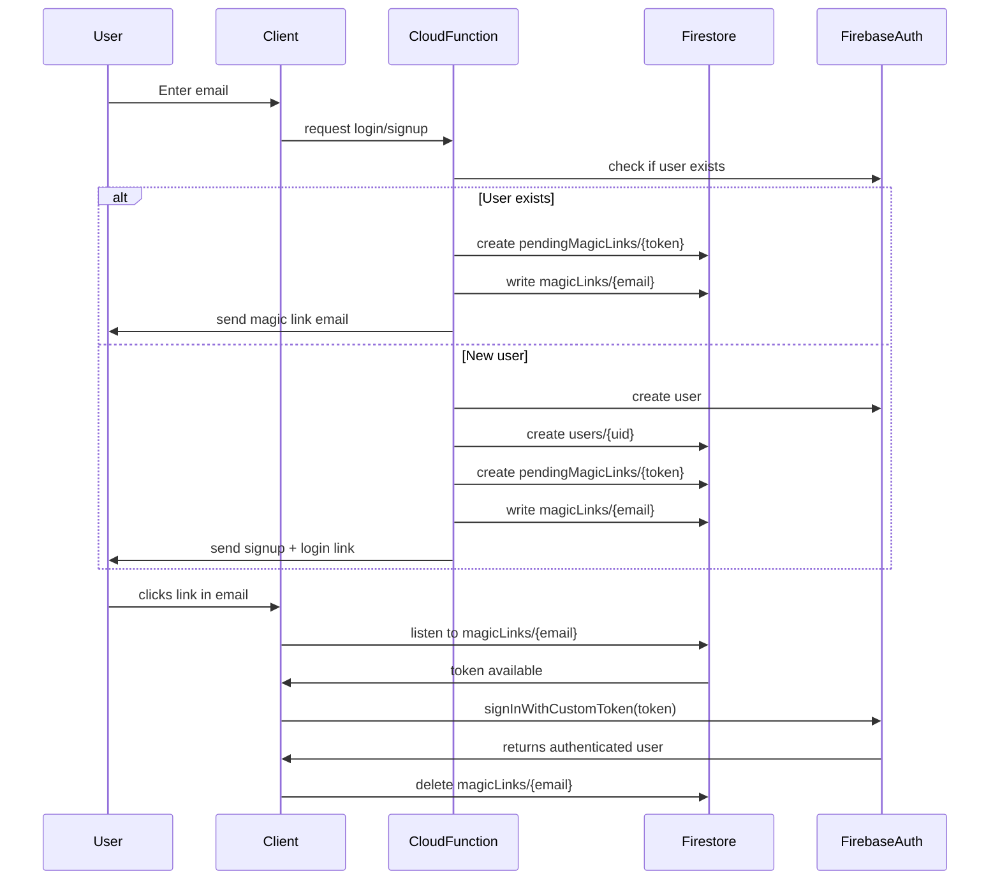

# Firebase
This branch handles firebase setup. It is intented to keep all the logic
for switching between firebase or emulator deploying.

## Deploy to emulators
1. npm install
2. firebase init
3. firebase init functions (just in case you want to add functions)
4. firebase emulators:start 
5. npm run dev

## Deploy to Firebase

## Files

```bash
src/
 ├─ firebase.js
 └─ firebase-emulators.js
```

## How to handle secrets in emulators
- Use .secret.local for local overrides
- In your functions/ folder, create a file .secret.local
- Add your test keys there (for example, your Stripe test secret).
```bash
STRIPE_SECRET=sk_test_123456...
```
When you run:
```bash
firebase emulators:start
```
the emulator will load these secrets for your functions.

## How to handle secrets in production
- In prod, you still set your secrets using:
```bash
firebase functions:secrets:set STRIPE_SECRET
```
- This stores them securely in Secret Manager and they’ll only be accessible in deployed functions.


---
# User Management

## Files
```bash
utils/
 └─ setAdmin.js                    # For setting admin role for a given email

functions/
 └─ users.js                       # Firebase user functions

src/
 └─ features/
     └─ auth/
         ├─ AuthContext.jsx        # React context for Auth
         ├─ LoginDialog.jsx        # Login form
         ├─ PhoneNumberInput.jsx   # Phone number input form
         ├─ RoleGuard.jsx          # Enable/Disable react component
         ├─ SignUpDialog.jsx       # SignUp form
         ├─ LoginIconButton.jsx    # This is the starter of a login -> signup dialog flow
         ├─ UserCard.jsx           # A UserCard for helpdesk
         └─ users.js               # Users helpers functions
```

## Firestore Collections for Users Feature

The **users feature** relies on several Firestore collections to manage authentication, profiles, and passwordless login via magic links.  

### users/{uid}
- Stores persistent profile information for each Firebase Auth user.  
- Document ID = the user’s **Firebase UID**.  
- Created at signup and updated when user details change.  

Example:
```json
{
  "uid": "abcd1234",
  "email": "alice@example.com",
  "firstName": "Alice",
  "lastName": "Smith",
  "phone": "+123456789",
  "createdAt": "2025-09-16T10:00:00Z"
}
```

### pendingMagicLinks/{token}
- Temporary storage for magic link sign-in tokens.
- Document ID = random UUID token.
- Created when a login/signup flow generates a magic link.
- Automatically expires after a configured time.

Example:
```json
{
  "email": "alice@example.com",
  "createdAt": 1694863200000,
  "expiresAt": 1694866500000
}
```

### magicLinks/{email}
- Stores an active magic link token for a specific email address.
- Used by the client waitForUserLinkClick function to detect when a token is available.
- Automatically deleted once the user logs in.

Example:
```json
{
  "token": "customFirebaseToken123",
  "issuedAt": 1694863200000
}
```

### Collection Relationships
- users → Permanent user profiles tied to Firebase Auth UID.
- pendingMagicLinks → Temporary tokens waiting to be redeemed (server-managed).
- magicLinks → Bridge between email and issued custom tokens (client listens for these).

### Flow Summary
- Sign up → creates a new users/{uid} document.
- Login → generates a token in pendingMagicLinks, issues a link, and writes a magicLinks/{email} entry until it’s used.
- Client → listens to magicLinks/{email} until the token appears, then signs in.

### Flow Diagram



## Setting the first admin user 
User must exist first

node utils/setAdmin.js <email>

## Components
### RoleGuard Component

The RoleGuard component is used to control access to parts of the application based on the authenticated user's role. It checks the user's claims from the AuthContext and only renders its children if the user has one of the allowed roles. Otherwise, it renders a fallback message or component.

#### Example of use 
```jsx
      <RoleGuard allowedRoles={["editor", "admin"]} fallback={<div>No access</div>}>
        <div>Editor tools</div>
      </RoleGuard>
```

# Customer Support Chat Documentation

## Overview
This project implements a real time chat system for customer support using React and Firebase Firestore. The solution includes two main roles

- User customers can initiate chats from the website
- Support support agents can manage multiple conversations via a support panel

The chat is updated in real time through Firestore listeners and now supports image uploads

## Components

### Chat
- src/features/chat/Chat.jsx  
Displays a conversation between a user and support  

When role is user
- A random chatId is generated and persisted in localStorage
- Messages are stored in Firestore under this chatId
- Closing the chat only hides it locally the Firestore data remains
- Users can upload images by selecting files or dragging and dropping them into the conversation
- Uploaded images are stored in Firebase Storage and their download URLs are saved in Firestore

When role is support
- The chatId must be passed as a prop
- Support can send and read messages for that chat
- Closing the chat removes the conversation from Firestore and deletes related images from Firebase Storage

### SupportPanel
- src/features/chat/SupportPanel.jsx  
Displays all active chats on the left column  

Each chat shows
- The chatId or customer identifier if available
- The last message sent which may be text or an indicator that an image was sent

Selecting a chat highlights it in blue and loads the Chat component on the right  
When support closes a chat from the Chat component the chat disappears from the list and all messages and files are removed

## Firestore Structure

chats (collection)
 └── chatId (document)
      ├── participants: [ "user", "support" ]
      ├── createdAt: timestamp
      ├── updatedAt: timestamp
      ├── lastMessage: string
      └── messages (subcollection)
           └── messageId (document)
                ├── sender: "user" | "support"
                ├── text: string (optional)
                ├── imageUrl: string (optional)
                └── createdAt: timestamp


- Each user conversation is stored under a chatId
- Messages are kept in a messages subcollection
- Messages can contain text imageUrl or both
- Metadata such as lastMessage and updatedAt are used for the SupportPanel list

## Storage Structure

chats (folder in Firebase Storage)
 └── chatId (folder)
      ├── 1693928400000_photo.jpg
      ├── 1693928455000_invoice.png
      └── 1693928502000_screenshot.jpg


- Each chat has its own folder inside chats
- Files are named with a timestamp prefix to avoid collisions
- File references are linked back to Firestore messages via their imageUrl

## Functionality

- Users open a chat which creates or reuses a chat document in Firestore
- Messages are stored in the subcollection and synced in real time to both roles
- Users can upload images which are stored in Firebase Storage and linked in Firestore
- Support agents see a list of chats ordered by updatedAt and can open one to reply

Closing rules
- User close only UI is affected Firestore data remains
- Support close removes the chat document its messages and any uploaded images from Firebase Storage

## Developer Notes

- Chat uses Firestore onSnapshot to listen for real time updates
- Chat scrolling is handled automatically to always show the latest message
- Selected chat in SupportPanel is highlighted using Material UI ListItemButton with selected state
- LocalStorage is used to persist chatId for anonymous users so the conversation continues across page reloads
- Uploaded files are stored in Firebase Storage under chats chatId
- Support close cleans up both Firestore and Storage to prevent unused data
- Consider storing user metadata email name in the chat document to make the SupportPanel more user friendly
- For long term history instead of deleting chats on close consider marking them with a status field such as closed to allow auditing

## Future Improvements

- Add unread message counters for each chat in the SupportPanel
- Support multiple agents with chat assignment
- Store and display customer information instead of chatId
- Implement push notifications for new messages
- Add previews and support for non image file uploads
If you are developing a production application, we recommend using TypeScript with type-aware lint rules enabled. Check out the [TS template](https://github.com/vitejs/vite/tree/main/packages/create-vite/template-react-ts) for information on how to integrate TypeScript and [`typescript-eslint`](https://typescript-eslint.io) in your project.

---
# Navbar

## Overview
This project is a **React + Vite + Material UI (MUI)** application.  
It includes:
- A fixed **Navbar** (Google-like) using MUI `AppBar`.
- **Routing** with `react-router-dom`.
- Theming with `MUI ThemeProvider`.

---

## Project Structure

src/
 ├─ App.jsx               # Root component (theme + router)
 ├─ index.jsx             # Entry point (renders App)
 ├─ features/
 │   └─ navbar/
 │       └─ Navbar.jsx    # Top navigation bar
 ├─ assets/               # Static assets (logos, images)
 ├─ App.css               # Global styles

## Features

### Navbar
- Always visible at the top (`AppBar position="fixed"`).
- Contains logo/menu, search bar, and profile/actions.

### Routing
- Configured with **react-router-dom**.
- Example routes:
  - `/` → Home
  - `/about` → About

### Theming

In Material UI (MUI), a **theme** is a central configuration object that controls the look and feel of your application.  
It defines aspects such as:

- **Colors (palette):** primary, secondary, background, text colors, etc.
- **Typography:** font family, sizes, and weights.
- **Component defaults:** spacing, breakpoints, and style overrides.

By wrapping your app in a `ThemeProvider`, you ensure all components follow the same design rules.  
This makes it easy to apply consistent styling across the entire app and update the design in one place.

- Managed by **MUI ThemeProvider** and `createTheme`.
- Easy to customize palette and typography.

## Complete Example of Theme

In `App.jsx`, you can define a custom theme with colors, typography, and component overrides.

```jsx
const theme = createTheme({
  palette: {
    mode: "light", // or "dark"
    primary: {
      main: "#1976d2", // blue
    },
    secondary: {
      main: "#dc004e", // pink/red
    },
    background: {
      default: "#f5f5f5", // page background
      paper: "#ffffff",   // cards, sheets
    },
  },
  typography: {
    fontFamily: "'Roboto', 'Helvetica', 'Arial', sans-serif",
    h1: {
      fontSize: "2.5rem",
      fontWeight: 600,
    },
    h2: {
      fontSize: "2rem",
      fontWeight: 500,
    },
    body1: {
      fontSize: "1rem",
    },
  },
  components: {
    MuiButton: {
      styleOverrides: {
        root: {
          borderRadius: 12, // rounded buttons
          textTransform: "none", // keep text case as written
        },
      },
    },
    MuiAppBar: {
      styleOverrides: {
        root: {
          boxShadow: "none", // remove shadow
          borderBottom: "1px solid #e0e0e0",
        },
      },
    },
  },
});
```
