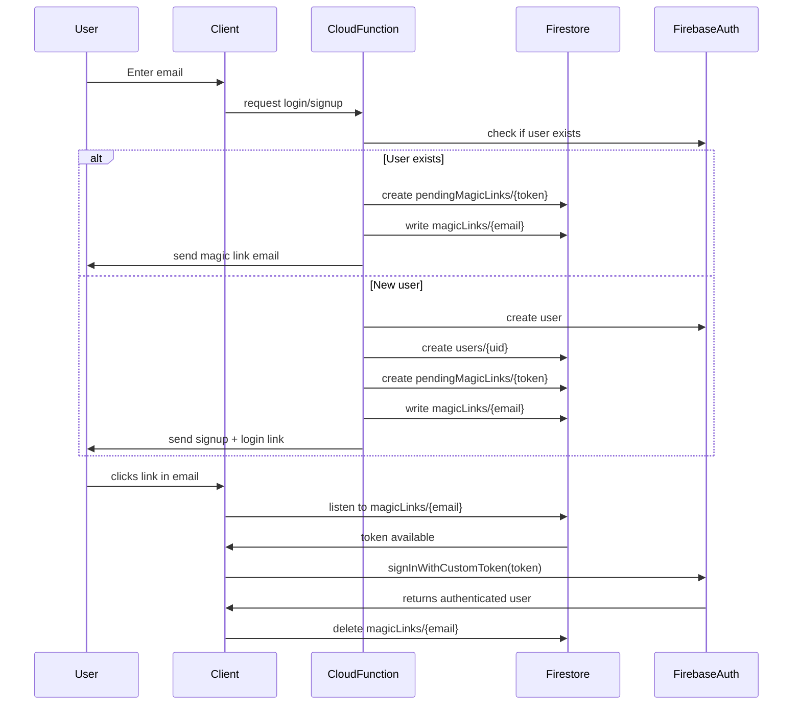
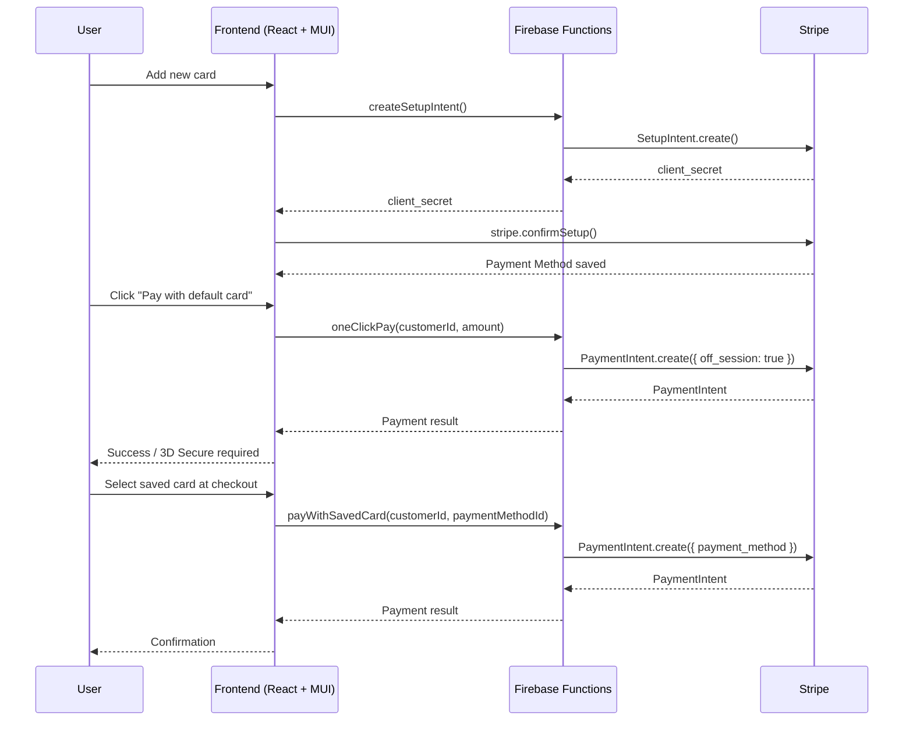

# Firebase
This branch handles firebase setup. It is intented to keep all the logic
for switching between firebase or emulator deploying.

## Deploy to emulators
1. npm install
2. firebase init
3. firebase init functions (just in case you want to add functions)
4. firebase emulators:start 
5. npm run dev

## Deploy to Firebase

## Files

```bash
src/
 ├─ firebase.js
 └─ firebase-emulators.js
```

## How to handle secrets in emulators
- Use .secret.local for local overrides
- In your functions/ folder, create a file .secret.local
- Add your test keys there (for example, your Stripe test secret).
```bash
STRIPE_SECRET=sk_test_123456...
```
When you run:
```bash
firebase emulators:start
```
the emulator will load these secrets for your functions.

## How to handle secrets in production
- In prod, you still set your secrets using:
```bash
firebase functions:secrets:set STRIPE_SECRET
```
- This stores them securely in Secret Manager and they’ll only be accessible in deployed functions.


---
# User Management

## Files
```bash
utils/
 └─ setAdmin.js                    # For setting admin role for a given email

functions/
 └─ users.js                       # Firebase user functions

src/
 └─ features/
     └─ auth/
         ├─ AuthContext.jsx        # React context for Auth
         ├─ LoginDialog.jsx        # Login form
         ├─ PhoneNumberInput.jsx   # Phone number input form
         ├─ RoleGuard.jsx          # Enable/Disable react component
         ├─ SignUpDialog.jsx       # SignUp form
         ├─ LoginIconButton.jsx    # This is the starter of a login -> signup dialog flow
         ├─ UserCard.jsx           # A UserCard for helpdesk
         └─ users.js               # Users helpers functions
```

## Firestore Collections for Users Feature

The **users feature** relies on several Firestore collections to manage authentication, profiles, and passwordless login via magic links.  

### users/{uid}
- Stores persistent profile information for each Firebase Auth user.  
- Document ID = the user’s **Firebase UID**.  
- Created at signup and updated when user details change.  

Example:
```json
{
  "uid": "abcd1234",
  "email": "alice@example.com",
  "firstName": "Alice",
  "lastName": "Smith",
  "phone": "+123456789",
  "createdAt": "2025-09-16T10:00:00Z"
}
```

### pendingMagicLinks/{token}
- Temporary storage for magic link sign-in tokens.
- Document ID = random UUID token.
- Created when a login/signup flow generates a magic link.
- Automatically expires after a configured time.

Example:
```json
{
  "email": "alice@example.com",
  "createdAt": 1694863200000,
  "expiresAt": 1694866500000
}
```

### magicLinks/{email}
- Stores an active magic link token for a specific email address.
- Used by the client waitForUserLinkClick function to detect when a token is available.
- Automatically deleted once the user logs in.

Example:
```json
{
  "token": "customFirebaseToken123",
  "issuedAt": 1694863200000
}
```

### Collection Relationships
- users → Permanent user profiles tied to Firebase Auth UID.
- pendingMagicLinks → Temporary tokens waiting to be redeemed (server-managed).
- magicLinks → Bridge between email and issued custom tokens (client listens for these).

### Flow Summary
- Sign up → creates a new users/{uid} document.
- Login → generates a token in pendingMagicLinks, issues a link, and writes a magicLinks/{email} entry until it’s used.
- Client → listens to magicLinks/{email} until the token appears, then signs in.

### Flow Diagram



## Setting the first admin user 
User must exist first

node utils/setAdmin.js <email>

## Components
### RoleGuard Component

The RoleGuard component is used to control access to parts of the application based on the authenticated user's role. It checks the user's claims from the AuthContext and only renders its children if the user has one of the allowed roles. Otherwise, it renders a fallback message or component.

#### Example of use 
```jsx
      <RoleGuard allowedRoles={["editor", "admin"]} fallback={<div>No access</div>}>
        <div>Editor tools</div>
      </RoleGuard>
```

---
# Navbar

## Overview
This project is a **React + Vite + Material UI (MUI)** application.  
It includes:
- A fixed **Navbar** (Google-like) using MUI `AppBar`.
- **Routing** with `react-router-dom`.
- Theming with `MUI ThemeProvider`.

---

## Project Structure

src/
 ├─ App.jsx               # Root component (theme + router)
 ├─ index.jsx             # Entry point (renders App)
 ├─ features/
 │   └─ navbar/
 │       └─ Navbar.jsx    # Top navigation bar
 ├─ assets/               # Static assets (logos, images)
 ├─ App.css               # Global styles

## Features

### Navbar
- Always visible at the top (`AppBar position="fixed"`).
- Contains logo/menu, search bar, and profile/actions.

### Routing
- Configured with **react-router-dom**.
- Example routes:
  - `/` → Home
  - `/about` → About

### Theming

In Material UI (MUI), a **theme** is a central configuration object that controls the look and feel of your application.  
It defines aspects such as:

- **Colors (palette):** primary, secondary, background, text colors, etc.
- **Typography:** font family, sizes, and weights.
- **Component defaults:** spacing, breakpoints, and style overrides.

By wrapping your app in a `ThemeProvider`, you ensure all components follow the same design rules.  
This makes it easy to apply consistent styling across the entire app and update the design in one place.

- Managed by **MUI ThemeProvider** and `createTheme`.
- Easy to customize palette and typography.

## Complete Example of Theme

In `App.jsx`, you can define a custom theme with colors, typography, and component overrides.

```jsx
const theme = createTheme({
  palette: {
    mode: "light", // or "dark"
    primary: {
      main: "#1976d2", // blue
    },
    secondary: {
      main: "#dc004e", // pink/red
    },
    background: {
      default: "#f5f5f5", // page background
      paper: "#ffffff",   // cards, sheets
    },
  },
  typography: {
    fontFamily: "'Roboto', 'Helvetica', 'Arial', sans-serif",
    h1: {
      fontSize: "2.5rem",
      fontWeight: 600,
    },
    h2: {
      fontSize: "2rem",
      fontWeight: 500,
    },
    body1: {
      fontSize: "1rem",
    },
  },
  components: {
    MuiButton: {
      styleOverrides: {
        root: {
          borderRadius: 12, // rounded buttons
          textTransform: "none", // keep text case as written
        },
      },
    },
    MuiAppBar: {
      styleOverrides: {
        root: {
          boxShadow: "none", // remove shadow
          borderBottom: "1px solid #e0e0e0",
        },
      },
    },
  },
});
```

---

# STRIPE-CHECKOUT

This project integrates **Stripe Checkout (Payment Element)** with **Firebase Functions**.  
Follow these steps to configure Stripe in both **test** and **production** environments.

## Files

```bash
functions/
 ├─ .secret.local                  # STRIPE_SECRET environment variable for firebase emulator
 └─ stripe.js                      # Stripe functionality wrapping
 
src/
 └─ features/
     └─ stripe/
         ├── PaymentMethodsManager.jsx     # Manage saved cards (list, add, delete, set default)
         ├── OneClickPayButton.jsx         # Pay immediately with default card
         ├── SavedCardCheckout.jsx         # Choose a saved card at checkout
         ├── cardBrandLogo.jsx             # Helper to render card logos (Visa, MasterCard, Amex, …)
         └── stripe.js                     # Frontend API wrappers (stripePromise, call Firebase functions)

public/
 └─ card-logos/
     ├─ visa.svg
     ├─ mastercard.svg
     └─ amex.svg

```

## Stripe Test Card Numbers

When using Stripe in test mode, you can simulate different scenarios by using the following card numbers:

| Card Type          | Number              | Expiry | CVC | Notes                                |
|--------------------|---------------------|--------|-----|--------------------------------------|
| Visa               | 4242 4242 4242 4242 | Any    | Any | Always succeeds                      |
| Mastercard         | 5555 5555 5555 4444 | Any    | Any | Always succeeds                      |
| American Express   | 3782 822463 10005   | Any    | Any | 15-digit number, 4-digit CVC         |
| Declined Card      | 4000 0000 0000 0002 | Any    | Any | Always declined                      |
| 3D Secure (pass)   | 4000 0025 0000 3155 | Any    | Any | Prompts 3DS authentication, succeeds |
| 3D Secure (fail)   | 4000 0000 0000 3063 | Any    | Any | Prompts 3DS authentication, fails    |
| Insufficient Funds | 4000 0000 0000 9995 | Any    | Any | Payment fails                        |

Use any future expiry date and any 3-digit CVC (4 digits for Amex).

More scenarios can be found in the official Stripe docs:  
https://stripe.com/docs/testing

## Get Your Stripe API Keys

1. Log into [Stripe Dashboard](https://dashboard.stripe.com/).  
2. In the left-hand sidebar, select **Home**.  
3. You’ll see:
   - **Publishable key** (starts with `pk_test_...` or `pk_live_...`) → used in frontend.
   - **Secret key** (starts with `sk_test_...` or `sk_live_...`) → used in backend (Firebase Functions).

**WARNING**: Never expose the secret key in frontend code.

## Stripe Secrets
### How to handle secrets in emulators
- Use .secret.local for local overrides
- In your functions/ folder, create a file .secret.local
- Add your test keys there (for example, your Stripe test secret).
```bash
STRIPE_SECRET=sk_test_123456...
```
When you run:
```bash
firebase emulators:start
```
the emulator will load these secrets for your functions.

### How to handle secrets in production
- In prod, you still set your secrets using:
```bash
firebase functions:secrets:set STRIPE_SECRET
```
- This stores them securely in Secret Manager and they’ll only be accessible in deployed functions.

## Enabling Additional Payment Methods
Stripe’s Payment Element automatically shows the methods that are:
- Enabled in your Dashboard [Stripe Dashboard](https://dashboard.stripe.com/).  
- Navigate to Settings -> Payments -> Payment Methods
- Supported for the currency and customer region
- Bizum → only for Spanish merchants, currency must be eur.
- Google Pay → requires HTTPS (or localhost), Chrome/Android with Google Pay configured.
- Apple Pay → requires domain verification in Stripe Dashboard and works only in Safari/iOS/macOS.

## Flow Overview
### Save Card
User adds card in PaymentMethodsManager.
Creates a SetupIntent via functions/setupIntents.js.
Card is saved to Stripe and linked to customer.

### One-Click Pay
- Backend (functions/paymentIntents.js) creates a PaymentIntent like:

```js
await stripe.paymentIntents.create({
  customer: stripeUID,
  amount,
  currency,
  payment_method: defaultPaymentMethodId,
  off_session: true, // no UI, immediate charge
  confirm: true,
});
```

- Frontend uses <OneClickPayButton /> to trigger this call.
- If successful → payment is confirmed.
- If fails (requires 3D Secure) → handle gracefully.

### Saved Card Checkout
- Frontend (SavedCardCheckout.jsx) lists saved cards.
- User selects one.
- Calls backend to create a PaymentIntent with that payment_method.
- If extra authentication is required, Stripe.js handles it.

### Sequence Diagram


